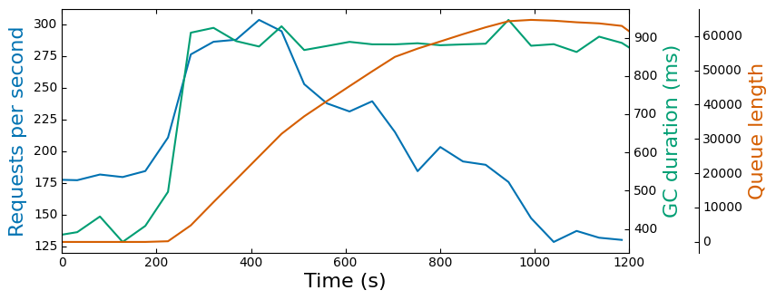

# Summary
Metastable failures due to Garbage Collection (GC). The mechanism is load-spike -> high queue length -> high GC behavior -> slowdown to requests processing -> high queue length. Please refer to Section 5.1 in the paper for more details.

## Dependencies
```bash
sudo apt-get install docker.io
sudo apt-get install python3-pip
pip3 install pandas
pip3 install matplotlib
```

## Reference system set up
* Instance type: AWS EC2 m5.large
* OS: Ubuntu 20.04

# Example Usage

```bash
sudo docker build -t exp .
./run.sh 0 -1 1200 0 256m
./analyze.py
./plot.py
```

The output plot is ./measurement_plots.png

# Example Results


